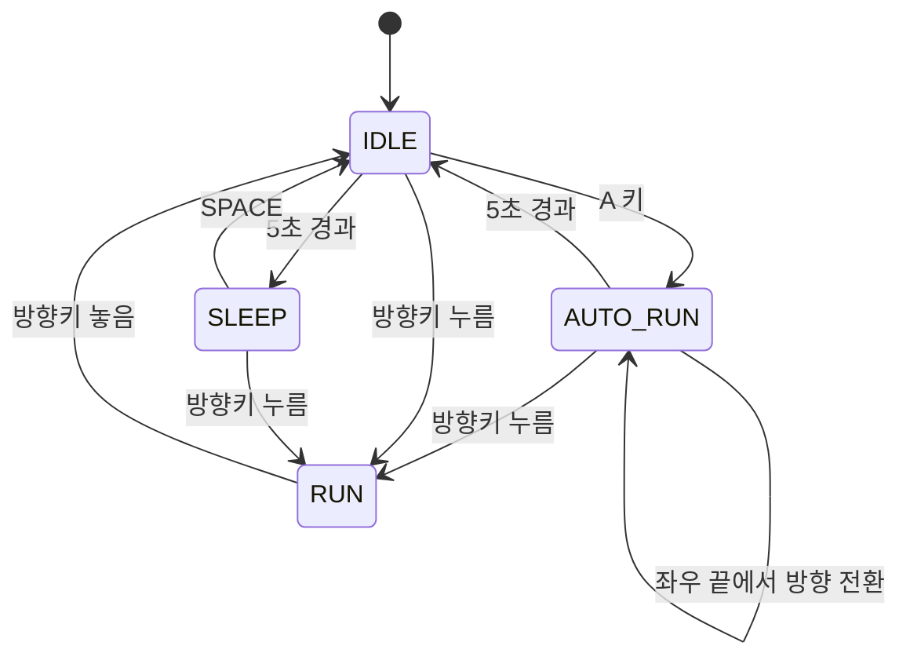

# Drill #11 상태 다이어그램

```mermaid
stateDiagram-v2
    [*] --> IDLE
    IDLE --> AUTO_RUN: A 키
    AUTO_RUN --> AUTO_RUN: 좌우 끝에서 방향 전환
    AUTO_RUN --> IDLE: 5초 경과
    AUTO_RUN --> RUN: 방향키 누름
    IDLE --> RUN: 방향키 누름
    RUN --> IDLE: 방향키 놓음
    IDLE --> SLEEP: 5초 경과
    SLEEP --> IDLE: SPACE
    SLEEP --> RUN: 방향키 누름
```
